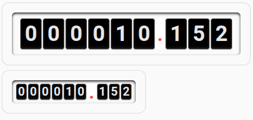

# HA-button-card-template

### Параметры, которые можно задавать:

--card-padding — отступы для всей карточки.

--card-background — фоновый градиент или цвет карточки.

--card-border — рамка карточки.

--card-border-radius — радиус углов карточки.

--card-box-shadow — тень карточки.

--card-height — высота карточки.

--card-width — ширина карточки.

Для кастомного поля meter:

--meter-gap — расстояние между цифрами.

--meter-font-size — размер шрифта цифр.

--meter-color — цвет цифр.

--meter-padding — отступы внутри кастомного поля.

--meter-border-radius — радиус углов кастомного поля.

--meter-box-shadow — тень кастомного поля.

Для цифр:

--meter-background — фон цифры.

--meter-color — цвет цифры.

--meter-width — ширина цифры.

--meter-height — высота цифры.

--meter-margin — отступ между цифрами.

--meter-border — рамка цифры.

--meter-border-radius — радиус углов цифры.

Для точки:

--meter-dot-width — ширина точки.

--meter-dot-font-size — размер шрифта точки.

--meter-dot-color — цвет точки.

--meter-dot-background — фон точки.
